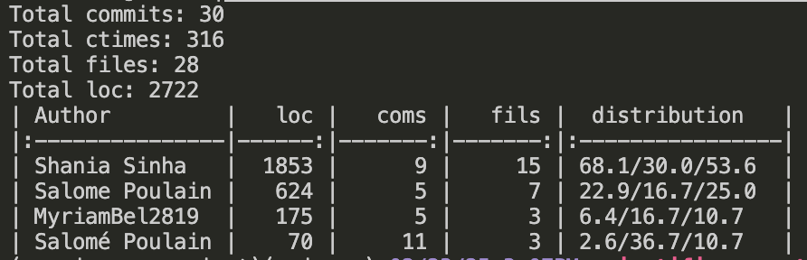
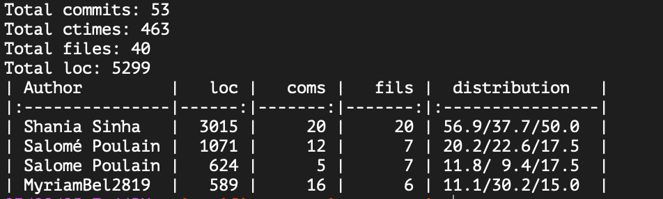

# Scientific Computing (Group 1)

[](https://opensource.org/licenses/MIT)

## Installation
To run this project locally, follow the steps below (replace [n] with the set number you want to access and run):

1. Clone the repository:
   ```bash
   git clone https://github.com/shaniasinha/scientific-computing-group-1.git
   cd scientific-computing-group-1
   ```
2. Install dependencies:
   ```bash
   pip install -r set_[n]/requirements.txt
   ```
3. Run Jupyter Notebook:
   ```bash
   jupyter notebook set_[n]/set[n].ipynb
   ```

## Usage
### Set 1:
- Open `set1.ipynb` in Jupyter Notebook for problem set 1.
- Follow the steps outlined in the notebook to run simulations and re-create the results.

### Set 2:
- Open `set2.ipynb` in Jupyter Notebook for problem set 2.
- Follow the steps outlined in the notebook to run simulations and re-create the results.

### Set 3:
- To be updated in the future.

## Project Structure
### Set 1:
```
scientific-computing-group-1/
│-- set_1/
   │-- set1.ipynb                                      # Jupyter notebook to run all code related to problem set 1
   │-- requirements.txt                                # Dependencies
   │-- src/                                            # Contains all classes and functions imported in the notebook
   │   │-- vibrating_string.py
   │   │-- time_dependent_diffusion.py 
   │   │-- jacobi_iteration.py
   │   │-- jacobi_iteration_optimized.py [*]
   │   │-- jacobi_with_sinks.py
   │   │-- jacobi_with_insulation.py
   │   │-- gauss_seidel_iteration.py
   │   │-- gauss_seidel_iteration_optimized.py [*]
   │   │-- gauss_seidel_with_sinks.py
   │   │-- succesive_over_relaxation.py
   │   │-- succesive_over_relaxation_optimized.py [*]
   │   │-- successive_over_relaxation_with_sinks.py
   │-- results/                                        # Plots and animations 
   │   │-- wave/
   │   │-- diffusion/
   │   │-- numerical_methods/
   │-- misc/                                           # Contains the problem set handout file and git fame results
   │-- archive/                                        # Earlier implementations that could be useful for later

```
[*] `_optimized` contain numba implementation for parallel processing.

### Set 2:
```
scientific-computing-group-1/
│-- set_2/
   │-- set2.ipynb                                      # Jupyter notebook to run all code related to problem set 2
   │-- requirements.txt                                # Dependencies
   │-- src/                                            # Contains all classes and functions imported in the notebook
   │   │-- analysis_dla.py
   │   │-- dla.py
   │   │-- monte_carlo_dla.py
   │   │-- gray_scott.py
   │-- results/                                        # Plots and animations 
   │   │-- dla_growth/
   │   │-- dla_mc/
   │   │-- gray_scott/
   │-- misc/                                           # Contains the git fame results
   │   │-- archive/                                    # Earlier implementations that could be useful for later

```

### Set 3:
- To be updated in the future.

## Contributing

### Set 1:
<div align="left">
    
</div>

### Set 2:
<div align="left">
    
</div>

### Set 3:
- To be updated in the future.

## Authors
- Myriam Belkhatir
- Shania Sinha
- Salomé Poulain

## License
This project is licensed under the MIT License - see the [LICENSE.md](LICENSE.md) file for details.
