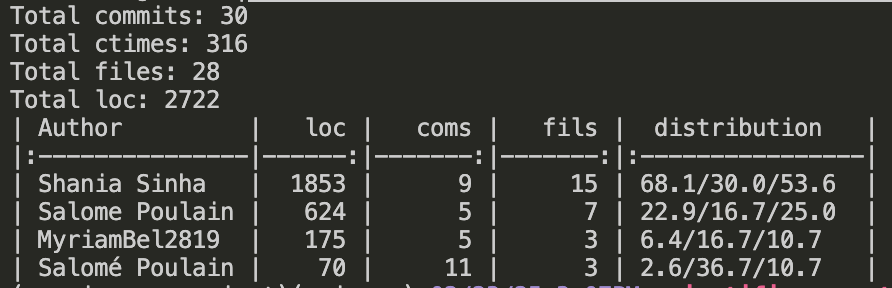

# Scientific Computing (Group 1)

[](https://opensource.org/licenses/MIT)

## Installation
To run this project locally, follow these steps:

1. Clone the repository:
   ```bash
   git clone https://github.com/shaniasinha/scientific-computing-group-1.git
   cd scientiffic-computing-group-1
   ```
2. Install dependencies:
   ```bash
   pip install -r requirements.txt
   ```
3. Run Jupyter Notebook:
   ```bash
   jupyter notebook set1.ipynb
   ```

## Usage
### Set 1:
- Open `set1.ipynb` in Jupyter Notebook for problem set 1.
- Follow the steps outlined in the notebook to run simulations and re-create the results.

### Set 2:
- To be updated in the future.

### Set 3:
- To be updated in the future.

## Project Structure
```
scientific-computing-group-1/
│-- set1.ipynb                                          # Jupyter notebook to run all code related to problem set 1
│-- requirements.txt                                    # Dependencies
│
│-- src/                                                # Contains all classes and functions imported in the notebook
│   │-- set_1/
│       │-- vibrating_string.py
│       │-- time_dependent_diffusion.py 
│       │-- jacobi_iteration.py
│       │-- jacobi_iteration_optimized.py [*]
│       │-- jacobi_with_sinks.py
│       │-- jacobi_with_insulation.py
│       │-- gauss_seidel_iteration.py
│       │-- gauss_seidel_iteration_optimized.py [*]
│       │-- gauss_seidel_with_sinks.py
│       │-- succesive_over_relaxation.py
│       │-- succesive_over_relaxation_optimized.py [*]
│       │-- successive_over_relaxation_with_sinks.py
│
│-- results/                                            # Final State Network data files 
│   │-- set1/ *
│       │-- wave/
│       │-- difussion/
│       │-- numerical_methods/
│
│-- misc/                                               # Contains the problem set handout file and git fame results
│-- archive/                                            # Earlier implementations that could be useful for later problem sets

```
[*] `_optimized` contain numba implementation for parallel processing.

## Contributing

### Set 1:
<div align="left">
    
</div>

### Set 2:
TBC

### Set 3:
TBC

## Authors
- Myriam Belkhatir
- Shania Sinha
- Salomé Poulain

## License
This project is licensed under the MIT License - see the [LICENSE.md](LICENSE.md) file for details.
